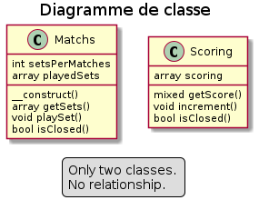
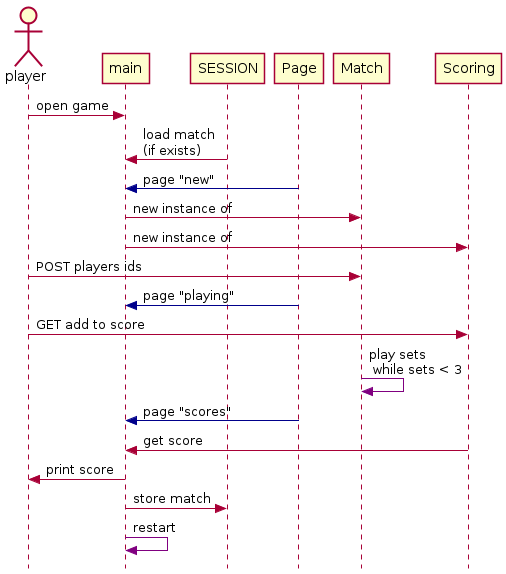

# Scoring tenis table wab App.

App to scoring tenis table matches.

## Tenis table rule 

Each matches has played with 3 to 4 set. 
Each will set endind with score : 
    11 points minimum for one player.
    2 point minimum of difference between players.

## Diagramme de classes

## Diagramme de sequences du main
